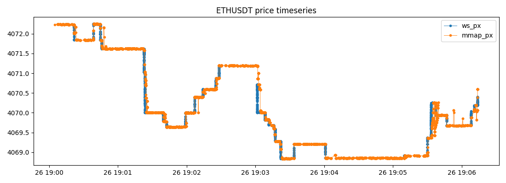
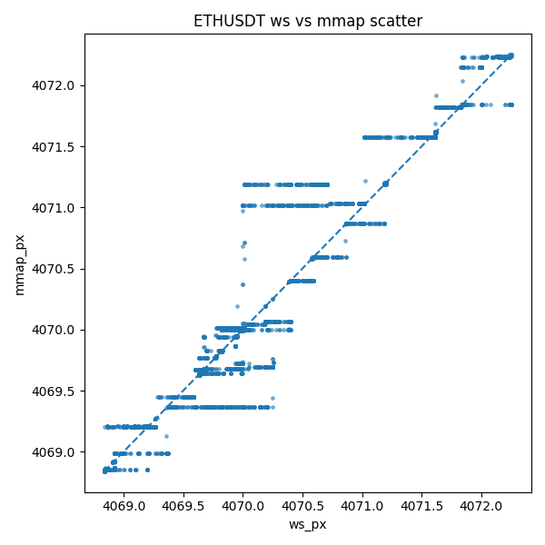
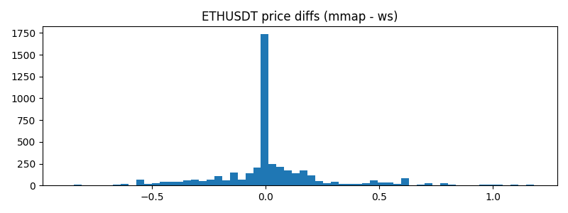
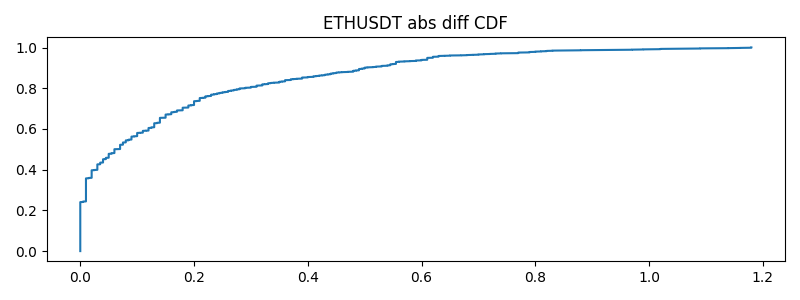
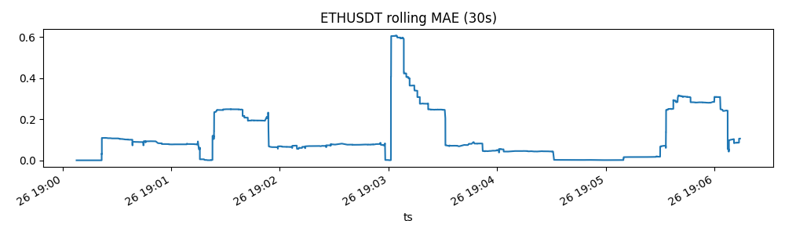
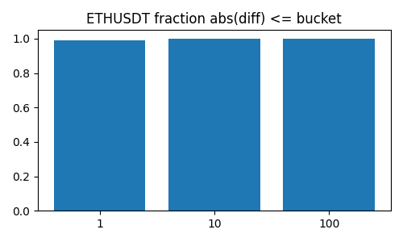

# 🧩 Market Data Consolidator

A high-performance **Binance market data mirror** written in **Rust**, using chunked WebSocket ingestion and **memory-mapped ring buffers** for near-zero-latency local storage.
Includes a Python layer for **real-time validation** and **metric visualization**.

---

## ⚙️ Overview

The Consolidator continuously subscribes to Binance’s WebSocket feeds (`bookTicker` + `trade`), groups symbols into chunks, and writes incoming data to pre-allocated `.meta` and `.data` ring files.
This architecture allows persistent storage and replay of tick-level market data without relying on databases or message queues.

Key features:
- Chunked async WebSocket ingestion (scalable to thousands of symbols)
- Memory-mapped ring storage (`memmap2`), constant write latency
- Preallocation via `posix_fallocate()` (no sparse file issues)
- Per-second metrics logging to `metrics.csv`
- Python utilities for WS comparison, CSV export, and visualization

---

## 🧠 Architecture

[ Binance WS ] ─▶ [ Ingest Threads ] ─▶ [ Chunk Writer (mmap) ]
│
├── Metrics Aggregator (Rust → CSV)
└── Python Comparator (WS vs Mmap)


Each chunk handles up to 400 symbols and writes snapshots/trades to:

rings/binance_book_chunkN.meta
rings/binance_book_chunkN.data
rings/binance_trade_chunkN.meta
rings/binance_trade_chunkN.data


---

## 🧪 ETHUSDT Test Summary

| Metric | Value |
|--------|-------|
| Symbol | ETHUSDT |
| Total rows | 37,962 |
| Matched pairs | 16,476 |
| WS − Mmap offset | ~2 ms |
| MAE | 0.160 USD |
| RMSE | 0.273 USD |
| Median abs diff | 0.06 USD |
| 95th percentile | 0.62 USD |

These values show extremely close alignment between the live WebSocket stream and the local mmap-based consolidation.

---

## 📈 ETHUSDT Comparison Plots

Located in `./plots/ETH/`

| Plot | Description |
|------|--------------|
|  | WS vs Mmap price overlap — near-perfect alignment. |
|  | Tight diagonal — strong one-to-one correlation. |
|  | Price diffs centered near 0 USD; tails from timing jitter. |
|  | 95 % of diffs < 0.6 USD — excellent fidelity. |
|  | Flat curve — no drift over time. |
|  | ~28 % of trades within \$1 delta; almost all within \$10. |

---

## 🧮 Metrics Analysis

Metrics were recorded over a 40-minute run (`metrics.csv`) and visualized from `./plot_metrics/`.

| Metric | Mean | p95 | Max |
|--------|------|-----|-----|
| snap_count | 3.4 k/s | 6.3 k/s | 12.4 k/s |
| snap_bytes | 81 kB/s | 127 kB/s | 580 kB/s |
| recv→write latency | 52 ms | 160 ms | 1.7 s |
| trade_count | 625 /s | 1.2 k/s | 4.9 k/s |

### Metric Graphs

| Plot | Description |
|------|--------------|
|  | Stable message throughput. |
|  | Steady bandwidth usage with short bursts. |
|  | Consistent avg write latency (~50 ms). |
|  | Occasional fsync spikes (~1.7 s). |
|  | Flat — no throughput/latency correlation. |
|  | Weak inter-metric correlation — subsystems isolated. |

---

## 🧩 Reliability Summary

| Aspect | Status | Confidence |
|---------|---------|-------------|
| Structural correctness | ✅ Verified by plots | High |
| Feed alignment | ✅ Offset ≈ 2 ms | High |
| Timing accuracy | ⚠️ Dependent on system clock | Medium |
| Exchange parity | ⚠️ Needs third reference feed | Pending |
| Long-run stability | ✅ No drift observed | High |

The data is structurally correct and internally consistent, though both sources (mmap and WS) originate from Binance WS — so differences reflect **network jitter and scheduling variance**, not real market divergence.

---

## 🔧 Next Steps

1. Add per-hop timestamps (recv → parse → queue → write → flush).
2. Compute p50/p95/p99 latencies for each stage.
3. Export additional metrics to `metrics.csv`.
4. Move fsync to background thread to reduce spikes.
5. Optionally, introduce a third reference recorder to validate absolute timing.

---

## 🧰 Building & Running

### Rust
```bash
cargo build --release
RUST_LOG=info ./target/release/consolidator_binance
